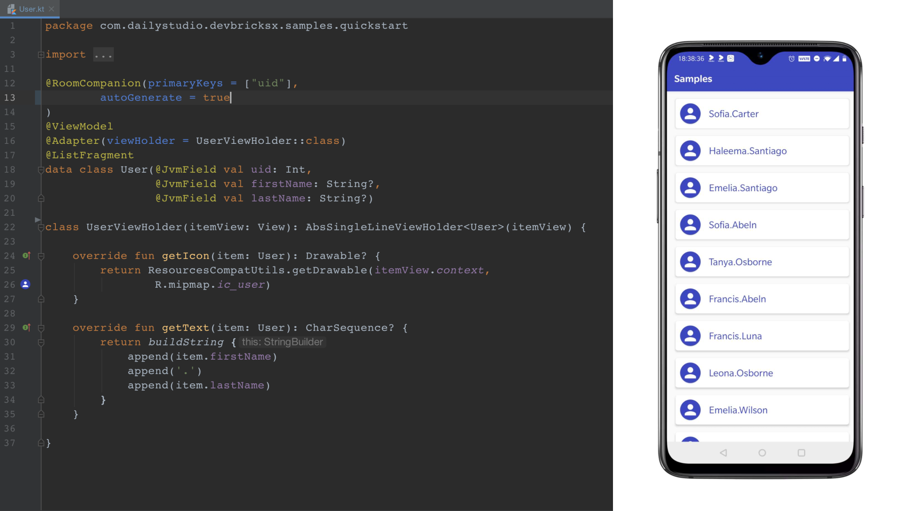

# DevBricks X
 

**DevBricksX** is a remake and extended version of [DevBricks](https://github.com/dailystudio/devbricks). It provides plenty of useful classes that will be used in daily Android development. With these "bricks", your development will become:

- **Efficient**: The classes provided by DevBricks almost cover all of the aspects in daily development, from the low-end database to the user interface. You do not need to waste your time on those repeating work.
- **Reliable**:  It has been integrated into enormous products. Your work will stand on a stable foundation. 
- **Consistent**: It includes a unified logging system, database accessing, UI elements, and styles. This makes all of your applications have consistency at the primary impression.

With only a few lines, you can save in memory **User** objects into database and represent them in a list:

#### Projects

Now it only includes libraries for **Android**. It will be extended to support more libraries on **Node.js**, **Python**, and **Flutter**.

- [Android](./android/README.md)
- Node.js
- Python
- Flutter
