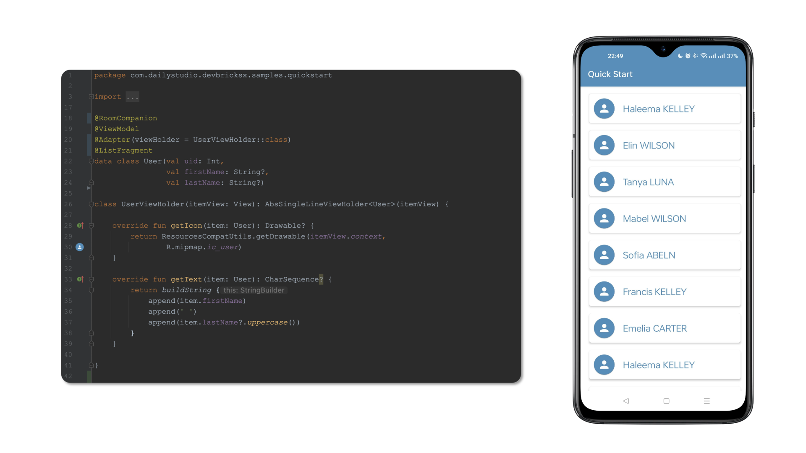

# DevBricks X - Android
[](http://www.apache.org/licenses/LICENSE-2.0) [](https://android-arsenal.com/api?level=19) [](https://maven-badges.herokuapp.com/maven-central/cn.dailystudio/devbricksx)

**DevBricksX** is a remake and extended version of [DevBricks](https://github.com/dailystudio/devbricks). It provides plenty of useful classes that will be used in daily Android development. With these "bricks", your development will become:

- **Efficient**: The classes provided by DevBricks almost cover all of the aspects in daily development, from the low-end database to the user interface. You do not need to waste your time on those repeating work.
- **Reliable**:  It has been integrated into enormous products. Your work will stand on a stable foundation. 
- **Consistent**: It includes a unified logging system, database accessing, UI elements, and styles. This makes all of your applications have consistency at the primary impression.

With only a few lines, you can save in memory **User** objects into database and represent them in a list:



## Quick Setup
To use **DevBricks X** Libraries in your application, follow the steps below.

### Step 1: Installation
Add the following dependencies in build.gradle of your application.

#### Dependencies

First, you need to adding dependencies in **build.gradle**:

```groovy
// (Optional) If you use annotations and processors to generate facilities, apply this plugi-n
plugins {
  id("com.google.devtools.ksp") version "$ksp_version"
}

repositories { 
    mavenCentral()
}

dependencies {
    // Basic Library for Android development
    implementation "cn.dailystudio:devbricksx:$devbricksx_version"

    // (Optional) Annotations and processors to generate facilities 
    implementation "cn.dailystudio:devbricksx-annotations:$devbricksx_version"
    ksp "cn.dailystudio:devbricksx-compiler:$devbricksx_version"
    // (Optional) If you use the feature above, DO NOT forget this line 
    ksp "androidx.room:room-compiler:2.4.3"
}
```

The latest version of dependencies above are:

```groovy
ksp_version = "1.7.10-1.0.6"
devbricksx_version = "1.6.7"
```

Then, if you are using annotations through [KSP (Kotlin Symbol Processing)](https://kotlinlang.org/docs/ksp-overview.html), DO NOT forget to add plug-ins repo in **settings.gradle**:

```groovy
pluginManagement {
    repositories {
        gradlePluginPortal()
    }
}

```

#### Compile options
Add the following compile options in build.gradle of your application module. They are important, please DO NOT ignore them.

```groovy
compileOptions {
    sourceCompatibility JavaVersion.VERSION_1_8
    targetCompatibility JavaVersion.VERSION_1_8
}

kotlinOptions {
    jvmTarget = "1.8"
}

// If you are useing KSP and your Room databases leveraging versioning features.
ksp {
    arg("room.schemaLocation", "$projectDir/schemas".toString())
}

// Source files generated by KSP cannot recognized by default, 
// you should manually configure them into the source sets.
sourceSets.configureEach {
    kotlin.srcDir("$buildDir/generated/ksp/$name/kotlin/")
}

```

> IMPORTANT:
>
> Now, DevBricksX is using KSP instead of Kapt to improve compilation performance and code quality. After version **1.6.6**, the following components are deprecated:
> 
> - devbricksx-java-annotation
> - devbricksx-kotlin-annotation
> - devbricksx-java-compiler
> - devbricksx-kotlin-compiler
> 
> After version **1.5.9**, you MUST add these compile options in your build script to use Java 1.8 binary code. And, REMOVE all the **@JvmField** in your codes.
>

### Step 2: Application initialization (Optional)
This step helps you to integrate parts of utilities automatically, such as Logging facilities. 

Extends your application from **DevBricksApplication**:

```kotlin
class MyApplication : DevBricksApplication() {

    override fun isDebugBuild(): Boolean {
        return BuildConfig.DEBUG
    }
    
}
```
The **BuildConfig** is the one generated for your top-level application not those for modules. It provides information about your build type to the library.

Then declare it in your **`AndroidMenifest.xml`**:

``` xml
<manifest>
    ...
    <application
        android:name=".MyApplication">
        ...
    </application>
    ...
</manifest>
```

## Usage
Now you can enjoy this library in your way. The facilities provided in this library include different topics, please read the instructions carefully in each topic for details.

- [**Logging**](./docs/logging.md)

    An enhanced logging system which can turn on/off debug outputs automatically.

- [**Gloabl Context**](./docs/globalcontext.md)

    A global context that you can use anywhere in your code without memory leaks.

- [**Database**](./docs/database.md)
    
    A set of utilities to simplify the usage of Android Room components. It can generate Room, Dao, Database, and Repository for a class through one annotation.

- [**UI**](./docs/ui.md)
    
    Plenty of classes to simplify high-level development. Combine with [**Database**](./docs/database.md) facilities, you can save an object in database and then represent it in a list view with less than 20 lines of code.


## Jcenter deprecation
Since [JFrog to Shut down JCenter and Bintray](https://www.infoq.com/news/2021/02/jfrog-jcenter-bintray-closure/), starting from version **1.4.1**, all the artifacts will be maintained under the groupdId **cn.dailystudio**. The versions before that will still available under the groupId **com.dailystudio**.

For example, if you want to refer to version **1.3.0**, you should add the following lines in your build.gradle

```groovy
repositories { 
    mavenCentral()
}

dependencies {
    implementation 'com.dailystudio:devbricksx:1.3.1'

    implementation 'com.dailystudio:devbricksx-java-annotations:1.3.1'
    implementation 'com.dailystudio:devbricksx-kotlin-annotations:1.3.1'

    kapt 'com.dailystudio:devbricksx-java-compiler:1.3.1'
    kapt 'com.dailystudio:devbricksx-kotlin-compiler:1.3.1'
}
```

## License
    Copyright 2021 Daily Studio.

    Licensed under the Apache License, Version 2.0 (the "License");
    you may not use this file except in compliance with the License.
    You may obtain a copy of the License at
    
       http://www.apache.org/licenses/LICENSE-2.0
    
    Unless required by applicable law or agreed to in writing, software
    distributed under the License is distributed on an "AS IS" BASIS,
    WITHOUT WARRANTIES OR CONDITIONS OF ANY KIND, either express or implied.
    See the License for the specific language governing permissions and
    limitations under the License.
