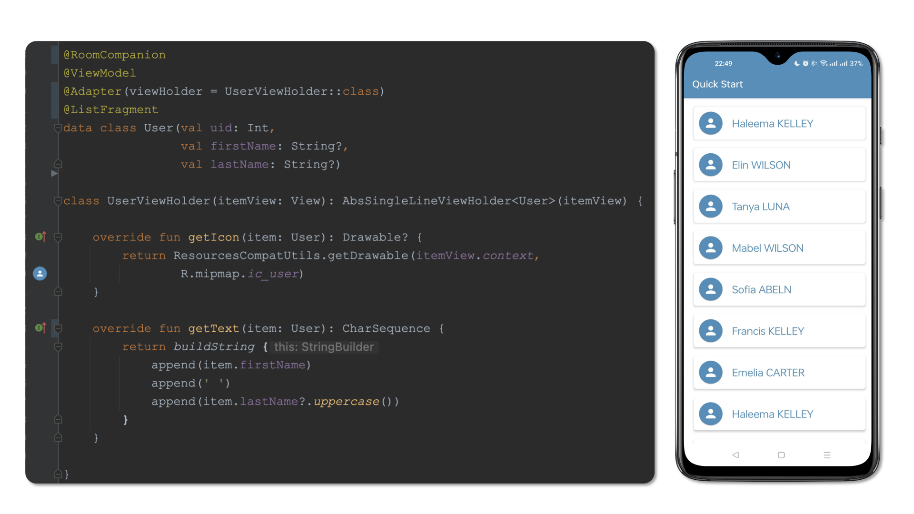

# DevBricks X - Android
[](http://www.apache.org/licenses/LICENSE-2.0) [](https://android-arsenal.com/api?level=19) [ ](https://bintray.com/dailystudio/maven/devbricksx/1.0.5/link)

**DevBricksX** is a remake and extended version of [DevBricks](https://github.com/dailystudio/devbricks). It provides plenty of useful classes that will be used in daily Android development. With these "bricks", your development will become:

- **Efficient**: The classes provided by DevBricks almost cover all of the aspects in daily development, from the low-end database to the user interface. You do not need to waste your time on those repeating work.
- **Reliable**:  It has been integrated into enormous products. Your work will stand on a stable foundation. 
- **Consistent**: It includes a unified logging system, database accessing, UI elements, and styles. This makes all of your applications have consistency at the primary impression.

With only a few lines, you can save in memory **User** objects into database and represent them in a list:



## Quick Setup
To use **DevBricks X** Libraries in your application, follow the steps below.

### Step 1: Installation
Libraries are distributed via jcenter. Add the following dependencies in build.gradle of your application.


#### Jcenter

```groovy
repositories { 
    jcenter()
}
```

#### Dependencies

```groovy
dependencies {
    // Basic Library for Android development
    implementation "com.dailystudio:devbricksx:$devbricksx_version"

    // (Optional) Annotations and processors to generate low-level facilities, such as Dao, Database, etc. 
    implementation "com.dailystudio:devbricksx-java-annotations:$devbricksx_version"
    kapt "com.dailystudio:devbricksx-java-compiler:$devbricksx_version"
    // (Optional) If you use the feature above, DO NOT forget this line 
    kapt "androidx.room:room-compiler:2.2.5"

    // (Optional) Annotations and processors to generate high-level utils, such ViewModel, Fragment, etc.
    implementation "com.dailystudio:devbricksx-kotlin-annotations:$devbricksx_version"
    kapt "com.dailystudio:devbricksx-kotlin-compiler:$devbricksx_version"
}
```

#### Latest version

```groovy
devbricksx_version = "1.0.5"
```

### Step 2: Application initialization (Optional)
This step helps you to integrate parts of utilities automatically, such as Logging facilities. 

Extends your application from **DevBricksApplication**:

```kotlin
class MyApplication : DevBricksApplication() {

    override fun isDebugBuild(): Boolean {
        return BuildConfig.DEBUG
    }
    
}
```
The **BuildConfig** is the one generated for your top-level application not those for modules. It provides information about your build type to the library.

Then declare it in your **`AndroidMenifest.xml`**:

``` xml
<manifest>
    ...
    <application
        android:name=".MyApplication">
        ...
    </application>
    ...
</manifest>
```

## Usage
Now you can enjoy this library in your way. The facilities provided in this library include different topics, please read the instructions carefully in each topic for details.

- [**Logging**](./docs/logging.md)

    An enhanced logging system which can turn on/off debug outputs automatically.

- [**Gloabl Context**](./docs/globalcontext.md)

    A global context that you can use anywhere in your code without memory leaks.

- [**Database**](./docs/database.md)
    
    A set of utilities to simplify the usage of Android Room components. It can generate Room, Dao, Database, and Repository for a class through one annotation.

- [**UI**](./docs/ui.md)
    
    Plenty of classes to simplify high-level development. Combine with [**Database**](./docs/database.md) facilities, you can save an object in database and then represent it in a list view with less than 20 lines of code.

## License
    Copyright 2020 Daily Studio.

    Licensed under the Apache License, Version 2.0 (the "License");
    you may not use this file except in compliance with the License.
    You may obtain a copy of the License at
    
       http://www.apache.org/licenses/LICENSE-2.0
    
    Unless required by applicable law or agreed to in writing, software
    distributed under the License is distributed on an "AS IS" BASIS,
    WITHOUT WARRANTIES OR CONDITIONS OF ANY KIND, either express or implied.
    See the License for the specific language governing permissions and
    limitations under the License.
