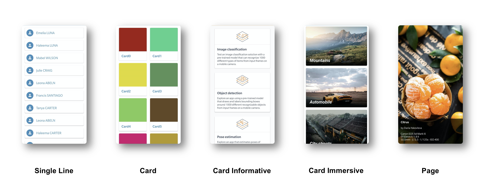

# Devbricks X Kotlin Annotations
This library provides annotations that simplify your development work with **ViewModel**, **Fragment**, etc.

## Installation
To use annotation and its compiler, add the following dependencies in build.gradle of your application.

#### Dependencies

```groovy
repositories { 
    mavenCentral()
}

dependencies {
    implementation "cn.dailystudio:devbricksx:$devbricksx_version"
    implementation "cn.dailystudio:devbricksx-kotlin-annotations:$devbricksx_version"

    kapt "cn.dailystudio:devbricksx-kotlin-compiler:$devbricksx_version"

    // (Optional) Annotations and processors to generate low-level facilities, such as Dao, Database, etc. 
    implementation "cn.dailystudio:devbricksx-java-annotations:$devbricksx_version"
    kapt "cn.dailystudio:devbricksx-java-compiler:$devbricksx_version"

    kapt "androidx.room:room-compiler:2.4.2"
}
```

#### Latest version

```groovy
devbricksx_version = "1.6.5"
```

If you want to auto-generate low-level facilities of an object class, such as **Dao**, **Database**, etc., DO NOT forget to include devbricksx-java-anntations and related compiler. See [devbricksx-java-annotations](../devbricksx-java-annotations/README.md) for more information.

## Quick Sample

Let's base on the **User** class we define in [devbricks-java-annotations](../devbricksx-java-annotations/README.md). Now we want to create an user interface for **User** class. It represents as a list of all the users that are stored in the database:

```kotlin
@RoomCompanion(primaryKeys = ["uid"],
        autoGenerate = true,
        extension = UserDaoExtension::class
)
@ViewModel
@Adapter(viewHolder = UserViewHolder::class)
@ListFragment
data class User(@JvmField val uid: Int,
                @JvmField val firstName: String?,
                @JvmField val lastName: String?)


@DaoExtension(entity = User::class)
interface UserDaoExtension {
    @Query("SELECT * FROM user WHERE uid IN (:userIds)")
    fun loadAllByIds(userIds: IntArray): List<User>

    @Insert
    fun insertAll(vararg users: User)
}

class UserViewHolder(itemView: View): AbsSingleLineViewHolder<User>(itemView) {

    override fun getIcon(item: User): Drawable? {
        return ResourcesCompatUtils.getDrawable(itemView.context,
                R.mipmap.ic_launcher)
    }

    override fun getText(item: User): CharSequence? {
        return buildString {
            append(item.firstName)
            append('.')
            append(item.lastName)
        }
    }

}
```
With a few lines of codes, you get a fragment named **UsersFragment**. You only need to add three annotations @ViewModel, @Adapter, and @ListFragment on **User** class and create a UserViewHolder class to map the data fields into the UI elements. 

With only around 40 lines, you get get an UI like this:


## Annotations

### 1. ViewModel
This annotation helps you generate a ViewModel class of an object class, like **User**. It extends from AndroidViewModel and encapsulates a Repository inside it.

The generated **ViewModel** class includes the following interfaces (use **User** class as an example) :

Interfaces | Descriptions
:--        | :--
allUsers | a LiveData of all the users
allUsersPaged | a LiveData of PagedList of users
getUser(id) | get a user with the specific identifier
getUsers() | get a list of of all the users
insertUser(user) | Insert a user
insertUsers(users) | Insert a list of users
updateUser(user) | Update a object
updateUsers(users) | Update a list of users
insertOrUpdateUser(user) | Insert a user or update if it exists
insertOrUpdateUsers(users) | Insert a list of users or update them if they are alreay existed
deleteUser(user) | Delete a user

The suffix of interfaces' names is different according to the name of the object class. For example, the interface of inserting a **Group** object is **insertGroup()**.

#### Parameters

- **group**
    
   Different object classes can share the same **ViewModel**. The interfaces of classes with the same group name will be generated in one ViewModel class.


- **repository**
    
    By default, all low-level implementations of generated **ViewModel** class are using an auto-generated Repository class by [devbricksx-java-annotations](../devbricksx-java-annotations/README.md). If you want to use your Repository for extension purposes. You can extend from the one which is auto-generated by our library or just write a completely new one. But if you start from scratch, you need to implement all the pre-defined functions which are described above.

### 2. Adapter
It will generate a **RecyclerAdapter** for you which derives from our abstract class **AbsPagedListAdapter**. It helps simplify the work of writing a recycler adapter. 

#### Parameters

- **viewHolder**
    
    Specify a **ViewHolder** class which is used to map the field of data objects into UI elements. If must be extended from our abstract class **AbsViewHolder**. **AbsViewHolder** provides you an interface, named **bind()** for mapping easily. For a simple layout, you can directly use **AbsSingleLineViewHolder** for convenience.

- **viewType**
    
    Indicate the layout of the item in the list. By default, it is **ViewType.SingleLine**, which means to use our pre-defined single-line item layout. Currently, there are five pre-defined view types: **ViewType.SingleLine**, **ViewType.Card**, **ViewType.CardInformative**, **ViewType.CardImmersive**, **ViewType.Page**
    
If you want to use your layouts, set this parameter to **ViewType.Customized** and set value of **layout** or **layoutByName** property to your own layout resources.

- **layout**
    
    If **viewType** is set to **ViewType.Customized**, this field will be used to specify which layout XML should be used to create an item view.

- **layoutByName**
    
    Similar to **layout**, if **viewType** is set to **ViewType.Customized**, this field will be used to specify which layout XML. But compare to **layout**, it uses a resource name instead of the identifier. This is useful when the resource is included in the library project since the identifier of the resource library is dynamic.
        
### 3. ListFragment
It helps you to generate a fragment with a list of objects of the target class. 
It retrieves the data through the **ViewModel** which is generated by **@ViewModel** annotation. If you want to retrieve the data in your way, inherit from the generated Fragment and override the function **getLiveData()**.

#### Parameters

- **layout**

    By default, the layout of this fragment is pre-defined in **Devbricks X** library. But you can specify your layout XML file. If you write your customized layout, it should include a **RecyclerView** and its identifier must be **android.R.id.list**. Otherwise, you have to override the **getRecyclerViewId()** of the generated fragment class to specify the identifier of your **RecyclerView**.

- **layoutByName**
    
    Similar to **layout**, but it uses a resource name instead of the identifier. This is useful when the resource is included in the library project since the identifier of the resource library is dynamic.

- **gridLayout**    

    By default, we user **LinearLayoutManager** to manage the layout of **RecycelerView**. You can set this parameter to true to use **GridLayoutManager**.

- **columns**    

    Specify the columns which are used for **GridLayoutManager**. By default, it is 2.

- **fillParent**    

    By default, we will generate a fragment with a **RecyclerView** that fills its parent. You can set this parameter to false to generate a fragment with a **RecyclerView** which occupies the minimum space which can just wrap its items.
    
- **superClass**    

    Specify a class that is derived from **AbsRecyclerViewFragment<Item, ItemList, Adapter>**. It will be used as the superclass of the generated fragments.
        
### 4. FragmentAdapter
It will generate a **FragmentStateAdapter** for you which derives from our abstract class **AbsFragmentStateAdapter**. It helps simplify the work of writing a **ViewPager2**. 

#### Parameters

- **pageFragment**
    
    Specify a **Fragment** class which is used to map the fields of a data object into a page of **ViewPager2**.
        
### 5. ViewPagerFragment
It helps you to generate a fragment and display each item in the list as a page of with a **ViewPager2**. It retrieves the data through the **ViewModel** which is generated by **@ViewModel** annotation. If you want to retrieve the data in your way, inherit from the generated Fragment and override the function **getLiveData()**.

#### Parameters

- **useFragment**

	By default, it uses auto-generated **ListAdapter** or **PagedListAdapter** to bind with **ViewPager2**. You can set the value of this parameter to true to use a 
**FragmentStateAdapter** which is auto-generated by **FragmentAdapter** annotation.

- **layout**

    By default, the layout of this fragment is pre-defined in **Devbricks X** library. But you can specify your layout XML file. If you write your customized layout, it should include a **ViewPager2** and its identifier must be **android.R.id.list**. Otherwise, you have to override the **getRecyclerViewId()** of the generated fragment class to specify the identifier of your **ViewPager2**.

- **layoutByName**
    
    Similar to **layout**, but it uses a resource name instead of the identifier. This is useful when the resource is included in the library project since the identifier of the resource library is dynamic.

- **offscreenPageLimit**
	Specify the number of offscreen pages of **ViewPager2**. By default, it is 1 which means there are 3 pages cached in memory.
        
### 5. NonRecyclableListFragment
It helps you to generate a fragment with a **NonRecyclableListView** of objects of the target class. It retrieves the data through the **ViewModel** which is generated by **@ViewModel** annotation. If you want to retrieve the data in your way, inherit from the generated Fragment and override the function **getLiveData()**.

- **layout**

    By default, the layout of this fragment is pre-defined in **Devbricks X** library. But you can specify your layout XML file. If you write your customized layout, it should include a **NonRecyclableListView** and its identifier must be **android.R.id.list**. Otherwise, you have to override the **getRecyclerViewId()** of the generated fragment class to specify the identifier of your **NonRecyclableListView**.

- **layoutByName**
    
    Similar to **layout**, but it uses a resource name instead of the identifier. This is useful when the resource is included in the library project since the identifier of the resource library is dynamic.


- **fillParent**    

    By default, we will generate a fragment with a **NonRecyclableListView** that fills its parent. You can set this parameter to false to generate a fragment with a **NonRecyclableListView** which occupies the minimum space which can just wrap its items.
