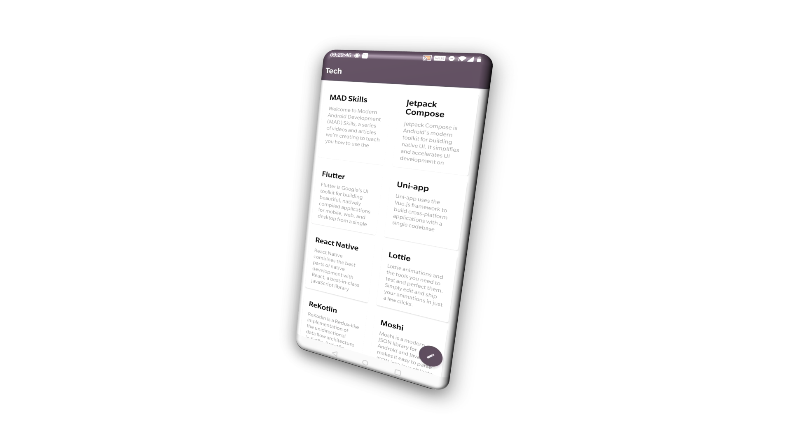
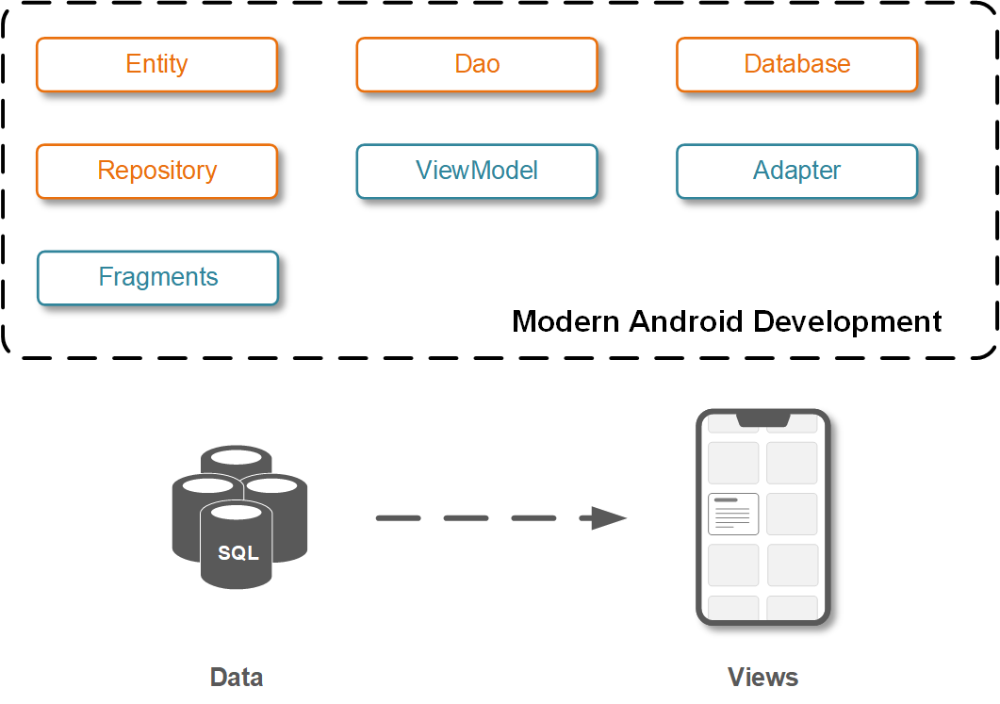
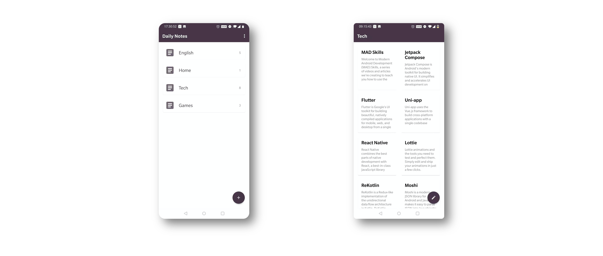

# Write a Notebook #2 - Display in lists



In the last chapter, we explained how to define objects in a notebook application. In this chapter, you will see how to represent them on the user interfaces.

## MVVM Components
If you are familiar with the MVVM design pattern, to represent an object on user interfaces, you usually have to create several classes, such as Entity, Repository, ViewModel, etc.



Generally, you have to write these classes above by yourself. But, if you are using **DevBricksX**, it will save a lot of work on the repetitive work: 

- **devbricks-java-annotaion** and **devbricks-java-compiler** generates **Entiy**, **Dao**, **Database**, and **Repository** for a specific data object.
- **devbricks-java-annotaion** and **devbricks-java-compiler** generates rest, including **ViewModal**, **Adapter**, and **Fragment**.

In the last chapter, you have already seen how **RoomCompanion** helps us to generate codes for low-level database operations.
Now, let us see how **DevBricksX** annotation processors help you to generate codes for high-level interactions. 

## Your magic props
To make the magic happens, you need to prepare some magic props. They are annotations, **ViewModel**, **Adapter** and **ListFragment**. Now, we add these three annotations on booth **Notebook** and **Note**.

### 1.**Notebook**
Let us still starts with **NoteBook**, the new defition looks like this:

```kotlin
@RoomCompanion(primaryKeys = ["id"],
    autoGenerate = true,
    converters = [DateConverter::class],
    extension = NotebookDaoExtension::class,
    database = "notes",
)
@ViewModel
@Adapter(viewType = ViewType.Customized,
        paged = false,
        layout = R.layout.layout_notebook,
        viewHolder = NotebookViewHolder::class)
@ListFragment
class Notebook(id: Int = 0) : Record(id) {
    @JvmField var name: String? = null
    @Ignore var notesCount: Int = 0
}
```
Compare to the declaration in the last chapter, there are three new annotations added. For each annotation, the compiler will generate a corresponding companion class.

- **ViewModel**

	This annotation indicates the compiler to generate a ViewModel class. For **Notebook** class, its name is **NotebookViewModel**. It encapsulates low-level CRUD operations and exposes MAD friendly interfaces for the application, like LiveData, suspends functions, and coroutines, etc. By default, the generated **ViewModel** class will reply on the implementation provided by **NotebookRepository** which is auto-generated by **RoomCompany** annotations. If you don't use **RoomCompanion** or have your different implementation, you have to derive this auto-generated class and override parts of it.

- **Adapter**

	This annotation indicates the compiler to generate an Adapter class. For **Notebook** class, its name is **NotebooksAdapter** and it is a subclass of **ListAdapter**. You can set **paged** parameter to *true* to make it derived from **PageListAdapter**. 
	
	**viewType** parameter of Notebook is **ViewType.Customized**, since we want to use our layout instead of using pre-defined ones. 
	
	For more configuration of **Adapter** annotation, please refer to [Devbricks X Kotlin Annoations](https://github.com/dailystudio/devbricksx-android/blob/master/devbricksx-kotlin-annotations/README.md#2-adapter)

- **ListFragment**

	This annotation indicates the compiler to generate a fragment class. For **Notebook** class, its name is **NotebooksListFragment**. We have no extra customization of this annotation and it displays all of the notebooks in a list.

As mentioned above, we use customized layout to represent notebooks. Here is the content of **layout_notebook.xml**:

```xml
<?xml version="1.0" encoding="utf-8"?>
<FrameLayout xmlns:android="http://schemas.android.com/apk/res/android"
    android:paddingStart="@dimen/lv_item_space_h"
    android:paddingEnd="@dimen/lv_item_space_h"
    android:paddingTop="@dimen/lv_item_space_v"
    android:paddingBottom="@dimen/lv_item_space_v"
    android:layout_width="match_parent"
    android:layout_height="wrap_content">

    <androidx.cardview.widget.CardView
        android:id="@+id/list_item_root"
        style="@style/DefaultCardView"
        android:layout_width="match_parent"
        android:layout_height="wrap_content">

        <RelativeLayout
            android:background="?attr/selectableItemBackground"
            android:layout_width="match_parent"
            android:layout_height="@dimen/lv_single_line_item_height">

            <ImageView
                android:id="@+id/list_item_icon"
                style="@style/DefaultListIcon"
                android:layout_alignParentStart="true"
                android:layout_centerVertical="true"/>

            <TextView
                android:id="@+id/notes_count"
                style="@style/NotesCount"
                android:layout_alignParentEnd="true"
                android:layout_centerVertical="true"
                android:layout_width="wrap_content"
                android:layout_height="wrap_content"/>

            <TextView
                android:id="@+id/list_item_text_line_1st"
                style="@style/DefaultListItemText1stLine"
                android:layout_toEndOf="@id/list_item_icon"
                android:layout_toStartOf="@id/notes_count"
                android:layout_alignParentEnd="true"
                android:layout_centerVertical="true"
                android:layout_alignWithParentIfMissing="true"
                android:layout_width="match_parent"
                android:layout_height="wrap_content"/>

        </RelativeLayout>

    </androidx.cardview.widget.CardView>

</FrameLayout>

```

For each notebook, we display its name, an icon, and the count of notes in it in a horizontal single-line layout. Correspondingly, the implementation of **NotebookViewHolder** is here:

```kotlin
class NotebookViewHolder(itemView: View) 
    : AbsSingleLineViewHolder<Notebook>(itemView) {

    override fun bind(item: Notebook) {
        super.bind(item)

        val notesCountView: TextView? = itemView.findViewById(R.id.notes_count)
        notesCountView?.text = if (item.notesCount == 0) {
            null
        } else {
            item.notesCount.toString()
        }
    }

    override fun getIcon(item: Notebook): Drawable? {
        val resId = if (item.isItemSelected()) {
            R.drawable.ic_selected
        } else {
            R.drawable.ic_notebook
        }

        return ResourcesCompatUtils.getDrawable(itemView.context,
                R.drawable.ic_notebook)
    }

    override fun getText(item: Notebook): CharSequence? {
        return item.name?.capitalize()
    }

}
```

**NotebookViewHolder** derives from **AbsSingleLineViewHolder** which has already implemented a set of essential functions that represent an object to a single-line layout. Basically, overriding **getIcon()** and **getText** is enough. Because we also want to display the count of notes in a notebook, we need to override **bind()** to handle displaying the count on the user interface.

### 2.**Note**
Similiarly, we also add three annotations on the **Note** declaration:

```kotlin
@RoomCompanion(primaryKeys = ["id"],
    autoGenerate = true,
    extension = NoteDaoExtension::class,
    database = "notes",
    foreignKeys = [ ForeignKey(entity = Notebook::class,
            parentColumns = ["id"],
            childColumns = ["notebook_id"],
            onDelete = ForeignKey.CASCADE
    )]
)
@ViewModel
@Adapter(viewType = ViewType.Customized,
        layout = R.layout.layout_note,
        viewHolder = NoteViewHolder::class)
@ListFragment(layout = R.layout.fragment_recycler_view_with_new_button,
        gridLayout = true)
class Note(id: Int = 0) : Record(id) {
    @JvmField var notebook_id: Int = -1
    @JvmField var title: String? = null
    @JvmField var desc: String? = null
}

```
The configuration of these annotations is almost the same as **Notebook**. The difference is that the parameter **gridLayout** of **ListFragment** annotation is set to *true* as we want to display notes in a two-column grid.

For **Note** class, we also use a customized informative card layout. The content of  **layout_note.xml** is:

```xml
<?xml version="1.0" encoding="utf-8"?>
<FrameLayout xmlns:android="http://schemas.android.com/apk/res/android"
	android:paddingStart="@dimen/lv_item_space_h"
	android:paddingEnd="@dimen/lv_item_space_h"
	android:paddingTop="@dimen/lv_item_space_v"
	android:paddingBottom="@dimen/lv_item_space_v"
	android:layout_width="match_parent"
	android:layout_height="match_parent">

	<androidx.cardview.widget.CardView
		android:id="@+id/list_item_root"
		style="@style/DefaultCardView"
		android:layout_width="match_parent"
		android:layout_height="match_parent">

		<RelativeLayout
			android:background="?attr/selectableItemBackground"
			android:orientation="vertical"
			android:layout_width="match_parent"
			android:layout_height="match_parent">

			<TextView
				android:id="@+id/card_title"
				style="@style/InformativeCardViewTitle"
				android:maxLines="2"
				android:layout_width="match_parent"
				android:layout_height="wrap_content"/>

			<TextView
				android:id="@+id/card_supporting_text"
				style="@style/NoteContent"
				android:layout_below="@id/card_title"
				android:layout_width="match_parent"
				android:layout_height="wrap_content"/>

		</RelativeLayout>

	</androidx.cardview.widget.CardView>

</FrameLayout>

```
For each note, we display its title and 6 lines brief of its content. **NoteViewHolder** derives from a pre-defined class **AbsInformativeCardViewHolder**. **AbsInformativeCardViewHolder** is used to map an object to a card with a media image on the top, a title, and a small paragraph of supporting text. **NoteViewHolder** only overrides its abstract functions and return the correct information. Here are its codes:

```kotlin
class NoteViewHolder(itemView: View) 
	: AbsInformativeCardViewHolder<Note>(itemView) {

    override fun getSupportingText(item: Note): CharSequence? {
        val context = itemView.context

        val text = item.desc
        return if (text.isNullOrEmpty()) {
            context.getString(R.string.label_empty)
        } else {
            text
        }
    }

    override fun getMedia(item: Note): Drawable? {
        return null
    }

    override fun getTitle(item: Note): CharSequence? {
        return item.title?.capitalize()
    }

    override fun shouldDisplayDivider(): Boolean {
        return true
    }
}
```

### 3. **DaoExtension**
In most cases, you needn't write an extension for **Dao** class. Auto-generated **Dao** classes have already included plenty of standard functions, e.g. CRUD, querying, etc. But, for special purposes, as we used in our application, you can inject your customization by set parameter **extension** of **RoomCompanion** annotation.

Different from normal cases, we have two special requirements:

- Display notes and notebooks in reverse chronological order
- Display a count of notes for each notebook

According to this, we defined two **DaoExtention** annotated class:

```kotlin
@DaoExtension(entity = Notebook::class)
abstract class NotebookDaoExtension {

    @Query("SELECT * FROM notebook ORDER BY last_modified DESC")
    abstract fun getAllNotebooksOrderedByLastModifiedLivePaged(): LiveData<List<Notebook>>

}

@DaoExtension(entity = Note::class)
abstract class NoteDaoExtension {

    @Query("SELECT * FROM note WHERE notebook_id = :notebookId ORDER BY last_modified DESC ")
    @Page(pageSize = 50)
    abstract fun getAllNotesOrderedByLastModifiedLivePaged(notebookId: Int): LiveData<PagedList<Note>>

    @Query("SELECT COUNT(*) FROM note WHERE notebook_id = :notebookId")
    abstract fun countNotes(notebookId: Int): Int

}
```
**DaoExtention** tells the compiler to generate helper **Dao** classes and use them in the final compilation. Eventually, generated **NoteDao** and **NotebookDao** will have these extended functions. Such kind of extension will be also passed encapsulated to higher levels, such as **Repository** and **ViewModal**.

## Last step
By default, auto-generated list fragments use the default interface in auto-generated **ViewModels** to retrieve data. For example, **NotebooksListFragment** uses **allNotebooksLive** in **NotebookViewModel** to get a list of notebooks which is sorted in ascending order of notebook identifiers.

As we have extended low-level database manipulation. Now, we need to tell list fragments to use these capabilities.

### 1. NotebooksListFragmentExt
We extend auto-generated class **NotebooksListFragment** and add override **getLiveData()** to do transformation:

```kotlin
override fun getLiveData(): LiveData<List<Notebook>> {
    notebookViewModel = ViewModelProvider(this).get(NotebookViewModel::class.java)

    val liveData = notebookViewModel.getAllNotebooksOrderedByLastModifiedLivePaged()

    return Transformations.switchMap(liveData) { notebooks ->
        val wrapper = mutableListOf<Notebook>()
        val ret = MutableLiveData<List<Notebook>>(wrapper)

        lifecycleScope.launch(Dispatchers.IO) {
            for (notebook in notebooks) {
                val noteViewModel =
                        ViewModelProvider(this@NotebooksFragmentExt)
                        	.get(NoteViewModel::class.java)

                notebook.notesCount = noteViewModel.countNotes(notebook.id)

                wrapper.add(notebook)
            }

            ret.postValue(wrapper)
        }

        ret
    }
}
```
Firstly, we retrieve a list of notebooks sorted by reverse chronological order through extended fucntion **getAllNotebooksOrderedByLastModifiedLivePaged()**. Then, for each notebook, we attach the count of notes by calling extended function **countNotes()**.

### 2. NotesFragmentExt
Extension work of **Note** is a bit simpler. We override **getLiveData()** by replace **allNotesPaged** with extended function **getAllNotesOrderedByLastModifiedLivePaged**:

```kotlin
override fun getLiveData(): LiveData<PagedList<Note>> {
    notebookViewModel = ViewModelProvider(this).get(NoteViewModel::class.java)

    return notebookViewModel.getAllNotesOrderedByLastModifiedLivePaged(notebookId)
}
```

## Magic happens
We are ready to watch the magic happens again. Include **NotebooksListFragmentExt** and **NotesFragmentExt** somewhere, then build the project and run it on your devices or emulators. You will see something like the image below.


## Summary
Now, you are clear about how to use **DevBricksX** to display your objects. Next time, I will show how to add a notebook or note through the user interface rather than codes. 

***To be continued ...***
