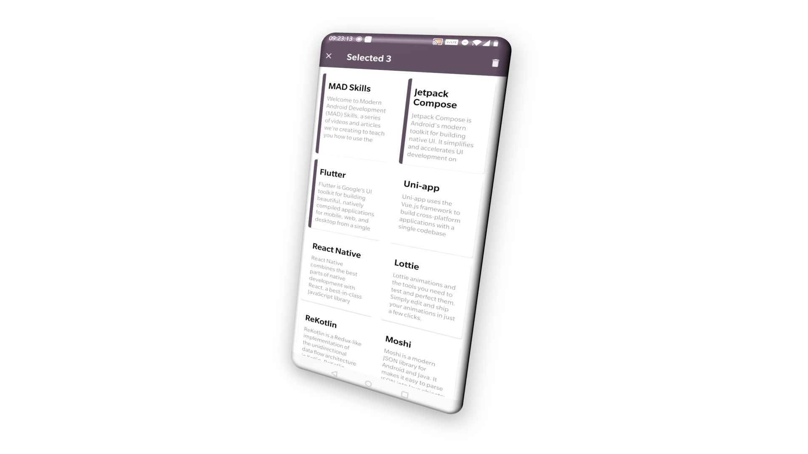

# Write a Notebook #3 - Multi-Selection support



In the last chapter, we showed you how to display notes and notebooks on the user interface. In this chapter, you will see how to select items in multi-selection mode.

It is very common to support multiple selections in an application. It enables users to do an operation efficiently on multiple items at the same time. But, indeed, it is also a headache for every developer. To support multi-selection, you usually need to consider the following problem:

- How to trigger it?
- How to distinguish selected ones?
- How to track selection?
- How to perform actions on selected items?
- How to exit multi-selection mode?

Fortunately, there are already numerous solutions available in open-source communities. Here, we will give you a quick introduction about how to do it with **DevBricksX** facilities.

## How to trigger it
It is not difficult to enable multi-selection in your application with **DevBricksX**. You only need to do a few things:

- Implement interface **SelectableListItem** on objects you want to use multi-selection 
- Inherit your adapter from **AbsListAdapter** or **AbsPagedListAdapter**
- Call **setSelectionEnabled()** when you want to enable this feature

> If you use **Adapter** annotation to generate the adapter, as we introduced in the last chapter, your adapters are ready to support multi-selection.

Now, let us implement **SelectableListItem** interface in our objects. In the last two charpters, we derive **Note** and **Notebook** from a pre-defined class **Record**. The **Record** class does not implement **SelectableListItem**. But, there is another pre-defined class, called **SelectableRecord**, which does the exact thing what we want. Here is its implementation:

```kotlin
@RoomCompanion(primaryKeys = ["id"],
        autoGenerate = true,
        converters = [DateConverter::class]
)
open class SelectableRecord(id: Int = 0) : Record(id), SelectableListItem {

    @Ignore
    var selected: Boolean = false

    override fun isItemSelected(): Boolean {
        return selected
    }

    override fun setItemSelected(selected: Boolean) {
        this.selected = selected
    }

}
```
**SelectableRecord** derive from **Record** and uses a field **selected** to store the selection state. Since **selected** is just an in-memory state and shouldn't be store in the database, it is annotated with **Ignore** annotation. **DevBricksX** annotation processors will ignore this field when generating codes.

> You may notice that **SelectableRecord** is also annotated with **RoomCompanion**.  Due to the implementation of **DevBricksX** annotation processors, if a class is annotated with **RoomCompanion**, all the classes in its inherent chain should be annotated with **RoomCompanion**. Otherwise, you will get errors thrown by **kapt**. 

The updated version of **Note** and **Notebook** is:

```kotlin
@RoomCompanion(primaryKeys = ["id"],
        autoGenerate = true,
        converters = [DateConverter::class],
        extension = NotebookDaoExtension::class,
        database = "notes",
)
@ViewModel
@Adapter(viewType = ViewType.Customized,
        paged = false,
        layout = R.layout.layout_notebook,
        viewHolder = NotebookViewHolder::class)
@ListFragment(layout = R.layout.fragment_recycler_view_with_new_button,
        superClass = AbsMultiSelectionListFragment::class)
open class Notebook(id: Int = 0) : SelectableRecord(id) {

    @JvmField var name: String? = null
    @Ignore var notesCount: Int = 0

}

@RoomCompanion(primaryKeys = ["id"],
        autoGenerate = true,
        extension = NoteDaoExtension::class,
        database = "notes",
        foreignKeys = [ ForeignKey(entity = Notebook::class,
                parentColumns = ["id"],
                childColumns = ["notebook_id"],
                onDelete = ForeignKey.CASCADE
        )]
)
@ViewModel
@Adapter(viewType = ViewType.Customized,
        layout = R.layout.layout_note,
        viewHolder = NoteViewHolder::class)
@ListFragment(layout = R.layout.fragment_recycler_view_with_new_button,
        gridLayout = true,
        superClass = AbsMultiSelectionListFragment::class)
class Note(id: Int = 0) : SelectableRecord(id) {

    @JvmField var notebook_id: Int = -1
    @JvmField var title: String? = null
    @JvmField var desc: String? = null

}
```
The last thing that we need to do is to call **setSelectionEnabled()**. We call it in **onViewCreate()** of **NotesFragmentExt** and **NotebooksListFragmentExt**

```kotlin
override fun onViewCreated(view: View, savedInstanceState: Bundle?) {
    super.onViewCreated(view, savedInstanceState)

    ...
    adapter?.setSelectionEnabled(true)
    ...
}
```
Then, multi-selection is enabled both for **Note** and **Notebook**.

## How to distinguish selected ones
After multi-selection is enabled, a long-press on any item will enter the multi-selection mode. In this sample notebook, we display a narrow bar with primary color at the left side of selected items, see the example below:


To implement this design, you need to add a bar in layout and override **bind()** in ViewHolder class and change the user interface according to different selection state. 

Using **Note** as the example, we add a narrow bar **layout_note.xml**

```xml
<?xml version="1.0" encoding="utf-8"?>
<FrameLayout xmlns:android="http://schemas.android.com/apk/res/android"
	android:paddingStart="@dimen/lv_item_space_h"
	android:paddingEnd="@dimen/lv_item_space_h"
	android:paddingTop="@dimen/lv_item_space_v"
	android:paddingBottom="@dimen/lv_item_space_v"
	android:layout_width="match_parent"
	android:layout_height="match_parent">

	<androidx.cardview.widget.CardView
		android:id="@+id/list_item_root"
		style="@style/DefaultCardView"
		android:layout_width="match_parent"
		android:layout_height="match_parent">

		<View
			android:id="@+id/selected_handler_start"
			android:background="@color/colorPrimary"
			android:layout_gravity="center_vertical|start"
			android:layout_width="@dimen/selector_width"
			android:layout_height="match_parent"/>

...

```

And, here are extra codes in **NoteViewHolder**:

```kotlin
override fun bind(item: Note) {
    super.bind(item)

    val handlerVisibility = if (item.isItemSelected()) {
        View.VISIBLE
    } else {
        View.GONE
    }

    val selectedHandlerStart: View? = 
    	itemView.findViewById(R.id.selected_handler_start)
    
    selectedHandlerStart?.visibility = handlerVisibility
}
```
The bar's visibility is changed according to return value of **item.isItemSelected()**. When user clicks on items in multi-selection mode, adapters provided in **DevBricksX** will call **item.setItemSelection()** to change this value.

# How to track selection
**DevBricksX** define an interface **OnSelectionChangedListener** to track any change in multi-selection mode:

```kotlin
interface OnSelectionChangedListener<Item> {

    fun onSelectionStarted()
    fun onSelectionStopped()
    fun onSelectionChanged(selectedItems: List<Item>)

}
```
You can call **adapter.setOnSelectionChangedListener()** to track by yourself. But, if you are using **ListFragment**, generated fragments include shortcut functions at ease. 
For example, in **NotesFragmentExt**, we want to display the count of selected items in the action bar. We override **onSelectionChanged()** of the fragment instead of implement a listener.

```kotlin
override fun onSelectionChanged(selectedItems: List<Item>) {
    super.onSelectionChanged(selectedItems)

    val count = selectedItems.size

    if (count > 0) {
        changeTitle(getString(R.string.prompt_selection, selectedItems.size))
    } else {
        changeTitle(null)
    }
}


protected open fun changeTitle(title: CharSequence?) {
    val actionBar = findActionBar() ?: return

    actionBar.title = title
}
```

## How to perform actions on selected items
When user finishes the selection, you need to perform the action on those selected items. In **NotesFragmentExt**, we provide users an option to delete selected items at one time. Here is the code:

```kotlin
override fun onOptionsItemSelected(item: MenuItem): Boolean {
    return when (item.itemId) {
        R.id.menu_delete -> {
            if (adapter?.isInSelectionMode() == true) {
                val items = adapter?.getSelection()
                items?.let {
                    performDeletion(it)
                }
            } else {
                Logger.warn("not in selection mode, skip")
            }

            true
        }

        else -> return super.onOptionsItemSelected(item)
    }
}
    
private fun performDeletion(items: List<Note>) {
    MaterialAlertDialogBuilder(context)
            .setTitle(R.string.label_delete)
            .setMessage(R.string.prompt_deletion)
            .setPositiveButton(android.R.string.ok) { _, _ ->
                val viewModel = 
                        ViewModelProvider(this)
                                .get(NoteViewModel::class.java)
                for (item in items) {
                    viewModel.deleteNote(item)
                }
            }
            .setNegativeButton(android.R.string.cancel) { _, _ ->
            }
            .show()
}
```
When a user clicks on the "Delete" item in the options menu, we call **adapter.getSelection()** to get selected items and pop up a dialog to make confirmation before doing the real deletion.

## How to exit multi-selection mode
The last step in the entire process is to exit the multi-selection mode. By simply calling **adapter.stopSelection()**, you can exit multi-selection immediately.

Here is the example of exiting selection then pressing the back key:

```kotlin
override fun onActivityCreated(savedInstanceState: Bundle?) {
    super.onActivityCreated(savedInstanceState)

    onBackPressedCallback = requireActivity()
            .onBackPressedDispatcher.addCallback(viewLifecycleOwner, false) {
        val adapter = adapter?: return@addCallback

        if (adapter.isInSelectionMode()) {
            adapter.stopSelection()
        }
    }
}
```

## Summary
In this chapter, you know how to implement multi-selection with **DevBricksX**. Till now, we have accomplished the most difficult parts of a notebook application. Next time, I will show you how to put these parts together.
