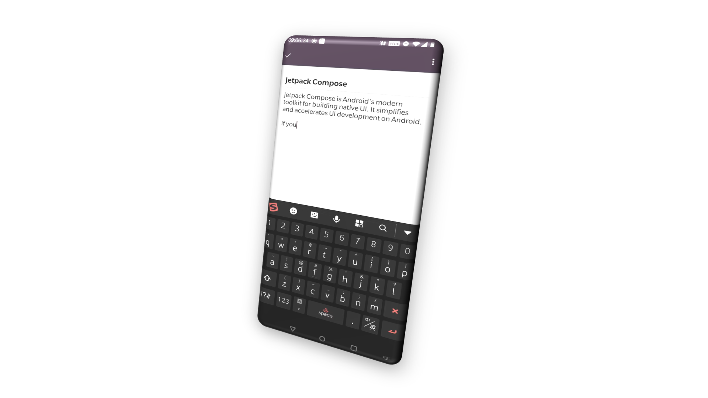
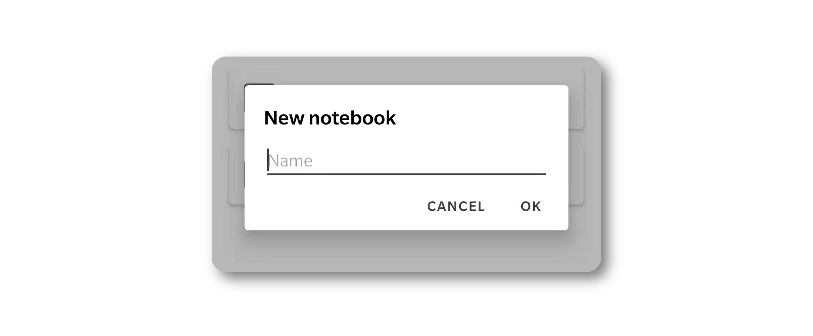
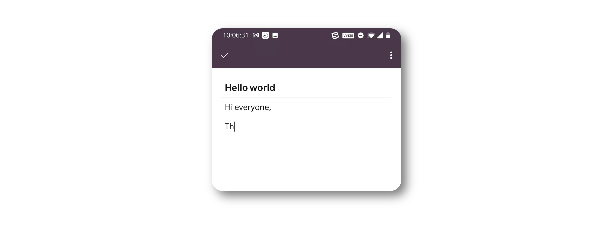
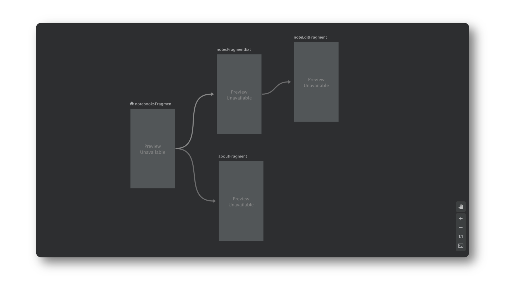

# Write a Notebook #4 - Put everything together


We have finished most features of the notebook application. In this chapter, let us accomplish the rest parts and put them together.

## Create a notebook
In previous chapters, we added notebooks programmatically. Now, we tend to notebook through user interface. 
Since adding notebook only requires a name input, it is enough to pop up a dialog.


**MaterialAlertDialogBuilder** is the best option to create the dialog. Here is the code:

```kotlin
MaterialAlertDialogBuilder(context)
        .setView(view)
        .setPositiveButton(android.R.string.ok) { dialog, which ->
            nbNameView?.let {
                val name = it.text.toString()
                if (name.isBlank()) {
                    Logger.warn("notebook name is empty, skip")
                    return@setPositiveButton
                }

                val notebook = Notebook.createNoteBook(name)

                notebookViewModel.insertNotebook(notebook)
            }
        }
        .setNegativeButton(android.R.string.cancel) { _, _ ->
        }
        .show()

```
And corresponding layout is:

```xml
<?xml version="1.0" encoding="utf-8"?>
<LinearLayout
    xmlns:android="http://schemas.android.com/apk/res/android"
    android:paddingStart="@dimen/default_content_padding_h"
    android:paddingEnd="@dimen/default_content_padding_h"
    android:paddingTop="@dimen/default_content_padding_v"
    android:orientation="vertical"
    android:layout_width="match_parent"
    android:layout_height="match_parent">

    <TextView
        android:text="@string/dialog_title_new_notebook"
        style="@style/DefaultTitleText"
        android:layout_width="wrap_content"
        android:layout_height="wrap_content"/>

    <EditText
        android:id="@+id/notebook_name"
        style="@style/DefaultEditText"
        android:hint="@string/hint_new_notebook"
        android:inputType="text"
        android:maxLines="1"
        android:layout_width="match_parent"
        android:layout_height="wrap_content">
        <requestFocus/>
    </EditText>

</LinearLayout>
```
There is a few options would matter user experience:

- The property **maxLines** of **EditText** for notebook name should be 1. Otherwise, the display will be become strange when user presses *enter*.
- Chech the **emptyness** of user's input before you add it into database. Otherwise, there will be some blank lines in your notebooks list.

## Edit a note
Creating a note is a bit complex than creating notebook. It is better to use a dediated fragment rather than a dialog. 

Since we are not intend to support rich format content, we can keep our user interface as clean and simple as possible.


The layout of the fragment is here:

```xml
<?xml version="1.0" encoding="utf-8"?>
<RelativeLayout xmlns:android="http://schemas.android.com/apk/res/android"
    android:id="@+id/fragment_view_root"
    android:padding="@dimen/default_content_padding"
    android:layout_width="match_parent"
    android:layout_height="match_parent">

    <EditText
        android:id="@+id/title"
        style="@style/TitleInput"
        android:background="@null"
        android:layout_width="match_parent"
        android:layout_height="wrap_content"/>

    <View
        android:id="@+id/divider"
        android:layout_below="@id/title"
        android:background="@drawable/list_divider"
        android:layout_width="match_parent"
        android:layout_height="2px"/>

    <EditText
        android:id="@+id/description"
        style="@style/DescInput"
        android:background="@null"
        android:layout_below="@id/divider"
        android:layout_alignParentBottom="true"
        android:layout_width="match_parent"
        android:layout_height="match_parent"/>

</RelativeLayout>
```
There are also some deatil that you need pay attention.

### EditText backgrounds
By default, EditText has a decorated background. When it is focused, a underline with primary color will appear at the bottom of EditText. Obviously, it is not aligned with our design. To remove it, you can add the following property on your EditText

```xml
<EditText
	...
    android:background="@null"
    ...
</EditText>    
```
### Show/Hide soft keyboard
Handling soft keyboard display is a problem you cannot avoid when you are using **EditText** in your application. Sometime, it does not pop up properly as you expected. You have to add extra codes to control it.

First, we extend **EditText** with a shorcut funtion:

```kotlin
fun EditText.showKeyboard() {
    post {
        if (requestFocus()) {
            val imm =
                    context.getSystemService(Context.INPUT_METHOD_SERVICE)
                            as InputMethodManager
            imm.showSoftInput(this, InputMethodManager.SHOW_IMPLICIT)
        }
    }
}
```
Then, we call it when we want to show the keyboard. For example, after when we have loaded content of an existing note to user interface, we prefer to set the editing cursor to the end of its desription and show the soft keyboard. It is a good experience for user to continue editing from the last saved point.

```kotlin
private fun attachNote(note: Note) {
    titleView?.setText(note.title)

    descView?.setText(note.desc)
    descView?.setSelection(note.desc?.length ?: 0)
    descView?.showKeyboard()
}
```

### Differentiate creating and editing
Creating a new note and editing an existing one share the same user interface. You can to handle different cases by a couple of arguments.

```kotlin
val args: NoteEditFragmentArgs by navArgs()
noteId = args.noteId
notebookId = args.notebookId

if (noteId != -1) {
    lifecycleScope.launch(Dispatchers.IO) {
        val viewModel = ViewModelProvider(this@NoteEditFragment)
                .get(NoteViewModel::class.java)

        val task = viewModel.getNote(noteId)
        task?.let {
            withContext(Dispatchers.Main) {
                attachNote(it)
            }
        }
    }
} else {
    descView?.showKeyboard()
}

```
As shown above, we differentiate these two cases by the value of notedId, which is passed through Navigation arguments. If **noteId** is -1, it indicates that we are creating a note from scratch. While if the **noteIde** is other values, we load the note from database and attach to user interface.

## About
An informative About is also required for an application. **DevBricksX** provides you quick way to generated your About screen.


**AbsAboutFragment** enables developer to show an About dialog with unified user interface layout. It includes:

- A top illustration area
	
	It shows an attrative image of your application. You can display your image by override **appThumbResource**. If it is set to -1, the dialog will not include a top illustration area.
	
- Application name
	
	It displays the name of your application. You must provide the value of **appName** when you implement **AbsAboutFragment**.
		
- Application version
	
	It shows the version of your application below the application name. It reads the value from your AndroidMenifest.xml automatically.
	
- Application description
	
	It displays a brief text of your application. You must provide the value of **appDescription** when you implement **AbsAboutFragment**.
	
- Application icon
	
	It displays an application icon sit along with the left side of application name. You must provide the value of **appIconResource** when you implement **AbsAboutFragment**.

Here is the final implementation of the AboutFragment:

```kotlin
class AboutFragment: AbsAboutFragment() {
    override val appName: CharSequence?
        get() = getString(R.string.app_name)

    override val appDescription: CharSequence?
        get() = getString(R.string.app_desc)

    override val appIconResource: Int
        get() = R.mipmap.ic_launcher

    override val appThumbResource: Int
        get() = R.drawable.app_thumb

}
```

## Connect parts with Android Navigation
This is the last part of the tutorial, you have already finished every single features of a notebook application. Now, you need to put them into differnt combination to contruct different usecases. You can do it by yourself or use **Navigation** in **Android Jetpack**.

We recommend you to use **Navigation** because its convenience. You can define different usecase by dragging-and-dropping fragments in a visual editor.

To active Navigation in your project, you have to add several dependencies in your Gradle build scripts.

In **build.gradle** under project root directory,

```groovy
dependencies {
    classpath 'androidx.navigation:navigation-safe-args-gradle-plugin:2.3.1'
}
```

Also, in **sample-notebook/build.gradle**

```groovy
apply plugin: "androidx.navigation.safeargs"

...

dependencies {

    implementation 'androidx.navigation:navigation-fragment-ktx:2.3.1'
    implementation 'androidx.navigation:navigation-ui-ktx:2.3.1'

}
 
```

Open navigation editor and create the user flows by link our fragments together.


You can also update your cases by editting the codes:

```xml
<?xml version="1.0" encoding="utf-8"?>
<navigation xmlns:android="http://schemas.android.com/apk/res/android"
    xmlns:app="http://schemas.android.com/apk/res-auto"
    xmlns:tools="http://schemas.android.com/tools"
    android:id="@+id/navi_graph"
    app:startDestination="@id/notebooksFragmentExt">
    <fragment
        android:id="@+id/notebooksFragmentExt"
        android:name="com.dailystudio.devbricksx.notebook.fragment.NotebooksFragmentExt"
        android:label="NotebooksFragmentExt" >
        <action
            android:id="@+id/action_notebooksFragmentExt_to_notesFragmentExt"
            app:destination="@id/notesFragmentExt"
            app:enterAnim="@anim/fragment_fade_enter"
            app:exitAnim="@anim/fragment_fade_exit" />
        <action
            android:id="@+id/action_notebooksFragmentExt_to_aboutFragment"
            app:destination="@id/aboutFragment" />
    </fragment>
    <fragment
        android:id="@+id/notesFragmentExt"
        android:name="com.dailystudio.devbricksx.notebook.fragment.NotesFragmentExt"
        android:label="NotesFragmentExt" >
        <argument
            android:name="notebookId"
            app:argType="integer" />
        <action
            android:id="@+id/action_notesFragmentExt_to_noteEditFragment"
            app:destination="@id/noteEditFragment" />
        <argument
            android:name="notebookName"
            app:argType="string" />
    </fragment>
    <fragment
        android:id="@+id/noteEditFragment"
        android:name="com.dailystudio.devbricksx.notebook.fragment.NoteEditFragment"
        android:label="NoteEditFragment">
        <argument
            android:name="noteId"
            android:defaultValue="-1"
            app:argType="integer" />
        <argument
            android:name="notebookId"
            app:argType="integer" />
    </fragment>
    <dialog
        android:id="@+id/aboutFragment"
        android:name="com.dailystudio.devbricksx.notebook.fragment.AboutFragment"
        android:label="AboutFragment" />
</navigation>
```

> The last element in **navigation** is for **AboutFragment**. The element is enclosed in a **\<dialog\>** tag. This is because **AboutFragment** derives from **AppCompatDialogFragment**. If you use **\<fragment\>** as reset ones, you will get a blank screen when you navigation to it.

## Summary
With this series of tutorials, I hope you can create your notebook application with **DevBricksX**. If you have you any question or problem, please feel free to contact me. I wish my tutorails and libraries could help you and save your time in everyday development.

