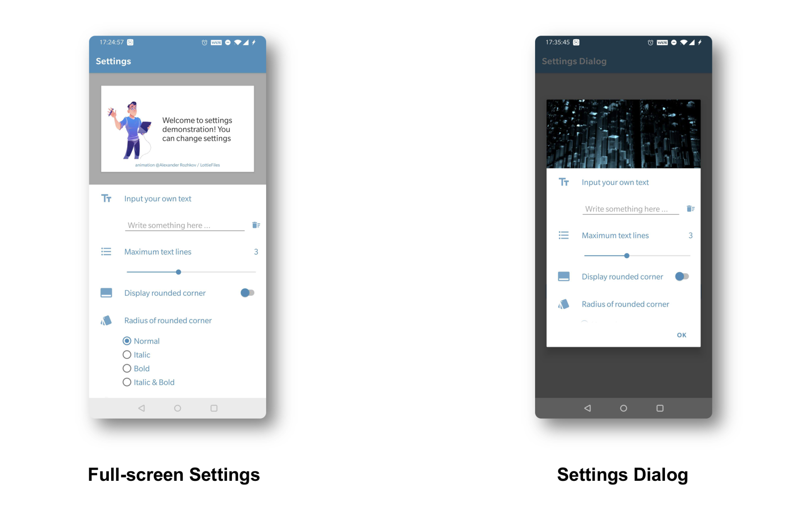
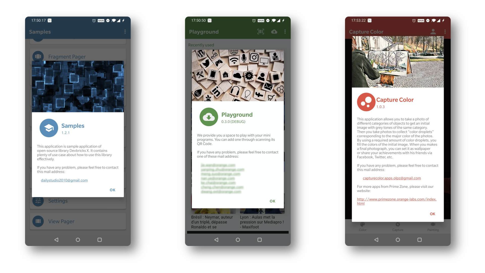

# UI

**Devbricks X** provides you numerous helper classes and annotations to simplify your development. 

## Installation
How to setup your builde.gradle, see the installation section of [devbricksx](../README.md).

- If you want to use high-level codes generation, like **ViewModel**, inlcudes **devbricksx-kotlin-annotation** and **devbricksx-kotlin-compiler**.

- If you want to use low-level codes generation, like **Database**, inlcudes **devbricksx-java-annotation** and **devbricksx-java-compiler**.

## Components
- **ViewModel**	

	With annotations's support, you can generate a ViewModal and a Fragment with RecyclerView automatically for a object class. Visit [devbricksx-kotlin-annotations](../devbricksx-kotlin-annotations/README.md) for more details.
	
- **Fragment**

	With annotations's support, you can generate a Fragment with **RecyclerView** / **ViewPager2** / **NonRecyclableListView** automatically for a set of objects. Visit [devbricksx-kotlin-annotations](../devbricksx-kotlin-annotations/README.md) for more details.
	
- **Settings**

	**AbsSettingsFragment** and **AbsSettingsDialogFragment** helps to create a full-screen page or a dialog to change the preferences of your application. Visit [Settings](./settings.md) for more details.
 

- **About**

	**AbsAboutFragment** helps to create an About dialog with a few lines of customization, including application name, version description, etc. Visit [About](./about.md) for more details.
 
