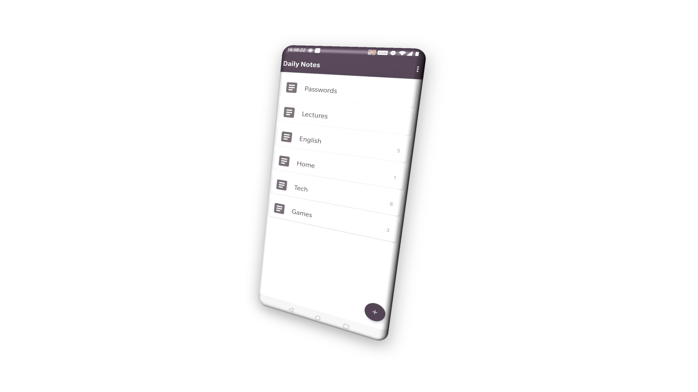

# A Notebook with DevBricksX

The codes under this directory show you how to write a notebook application with **DevBricksX** library. 

The application includes a set of basic features that a notebook usually has, including:

- Create text notes
- Display notes in a grid layout
- Create notebooks to manage notes separately
- Delete notes or notebooks in multiple selection mode
- Display notes and notebooks in reverse chronologic order

## Tutorials

Here are also a series of tutorials to explain the details:

1. [Tutorial #1 - Create the database](../docs/sample_notebook_tutorial_01.md)
1. [Tutorial #2 - Display in lists](../docs/sample_notebook_tutorial_02.md)

## License
    Copyright 2020 Daily Studio.

    Licensed under the GNU General Public License, Version 2.0 (the "License");
    you may not use this file except in compliance with the License.
    You may obtain a copy of the License at
    
       http://www.gnu.org/licenses/old-licenses/gpl-2.0.html
    
    Unless required by applicable law or agreed to in writing, software
    distributed under the License is distributed on an "AS IS" BASIS,
    WITHOUT WARRANTIES OR CONDITIONS OF ANY KIND, either express or implied.
    See the License for the specific language governing permissions and
    limitations under the License.

